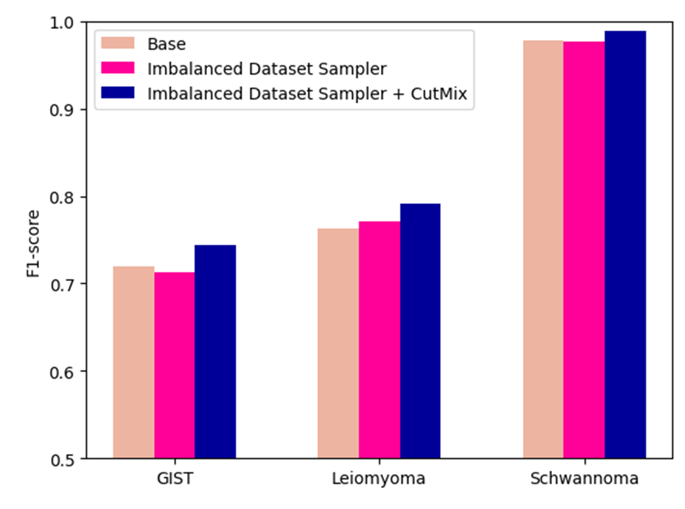

# GIST-classification
CutMix-Augmented Classification for Balancing Tumor Subtypes in Gastric Cancer: A Novel Approach to
Address Class Imbalance


## Abstract
The classification of cancer subtypes has significant importance due to the variability in cancer progression and prognosis that can be observed across different subtypes. Pathologists have traditionally employed manual examination of pathology slides through a microscope for the purpose of classifying subtypes. However, in response to the growing workload, recent endeavors have focused on the integration of deep learning algorithms as a means to mitigate this issue. The objective of this investigation was to employ a convolutional neural network to categorize gastric cancer subtypes, namely GIST, Leiomyoma, and Schwannoma, based on whole slide image (WSI) analysis. In many cases, there exists an imbalance in the distribution of subtypes, resulting in worse performance for classes that possess insufficient data. In order to mitigate the problem of class imbalance, we incorporated the CutMix training technique into our existing pipeline. In our approach, during the training phase, we employ CutMix within a limited number of classes to balance the data. During the inference phase, we read patches from WSIs and perform hard voting for the class with the highest count when the probability exceeds a certain threshold to classify the subtype at the WSI level. The class with the highest value, obtained from this calculation, is favored as the final classification for the WSI. In order to ascertain the efficacy of our approach, we employed it not only on an internal test dataset but also on an external test dataset. Accuracy of 0.98% and 0.93% were attained for each dataset, without a specified threshold. However, upon setting the threshold to 0.9, the accuracy exhibited improvement, reaching 0.99% and 0.94% for the corresponding datasets. It is expected that our pipeline will offer significant support in clinical environments for the categorization of different subtypes of gastric cancer.

### workflow


(A) illustrates an example of the CutMix method we used, while (B) depicts the process of the model learning patches that balance class distribution using the CutMix method. (C) represents the process of classifying subtypes at the WSI level.

## Performance

### Performance improvement for patch level


Applying the Imbalanced Dataset Sampler does not always guarantee performance improvement, but when applied in conjunction with CutMix, it shows further performance enhancement

---

### Performance improvement for slide level (Qualitative)


(A) GIST slide, classified as GIST with applying CutMix, while misclassified as leiomyoma without applying CutMix. (B) GIST slide, classified as GIST with applying CutMix, while misclassified as schwannoma without applying CutMix

---

### Performance improvement for slide level (Quantitative)
|||Accuracy|Precision|Recall|F1-score|
|:---:|:---:|:---:|:---:|:---:|:---:|
|Internal|no CutMix|0.98|0.94|0.98|0.96|
||CutMix|**0.99**|**0.95**|0.98|**0.97**|
|External|no CutMix|0.92|0.72|**0.96**|0.78|
||CutMix|**0.94**|**0.78**|0.95|**0.83**|

## Description

### Repository Structure
- [`data_generation/`](https://github.com/gotjd709/gist-classification/tree/master/data_generation): patch generation and offline cutmix augmentation directory
- `models/`: model directory
- `utils/`: utils for training and inference directory
- `train.py`: main training script
- `train.py`: main inference script

---

### train example
```
python train.py \
    -m resnet50 \
    -msp ./model_save_path.pth \
    -trp train.pickle \
    -vp valid.pickle \
    -tep test.pickle \
    -nsp normal_schwannoma.pickle \
    -nlp normal_leiomyoma.pickle \
    -lsp leiomyoma_schwannoma.pickle \
    --use_cutmix \
    --use_imb_sampler \
```

### pickle file example for train

```
[('/data1/sample11/1_1.png',tensor([1,0,0,0])),
('/cutmix_path/leiomyoma_schwannoma/1.png',tensor([0,0,0.73,0.27])),
...
]
```

---

### inference example
```
python inference.py \
    -dp data_df.csv \
    -mp ./model_save_path.pth \
    -sbd save_base_dir \
    -on organization_name \
```

you can download model weight [here](https://drive.google.com/drive/folders/1n8vU6bwRZ_uzqNwgL5tc_nsHJTUvE_be?usp=drive_link)

### csv file example for inference
```
slide_path
/data1/sample11.svs
/data1/sample12.svs
/data2/sample21.ndpi
/data2/sample22.ndpi
/data3/sample31.mrxs
/data3/sample32.mrxs
...
```
