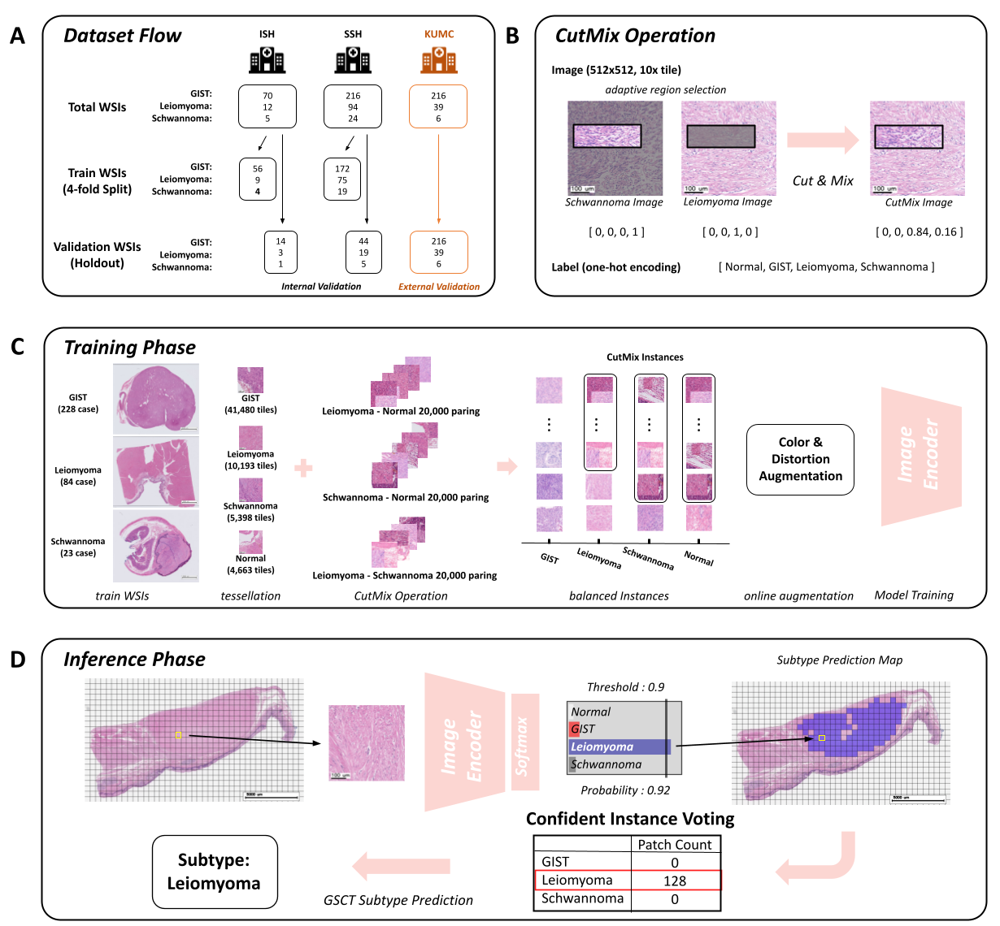

# GIST-classification
CutMix-Augmented Classification for Balancing Tumor Subtypes in Gastric Cancer: A Novel Approach to
Address Class Imbalance


## Abstract
The classification of cancer subtypes has significant importance due to the variability in cancer progression and prognosis that can be observed across different subtypes. Pathologists have traditionally employed manual examination of pathology slides through a microscope for the purpose of classifying subtypes. However, in response to the growing workload, recent endeavors have focused on the integration of deep learning algorithms as a means to mitigate this issue. The objective of this investigation was to employ a convolutional neural network to categorize gastric cancer subtypes, namely GIST, Leiomyoma, and Schwannoma, based on whole slide image (WSI) analysis. In many cases, there exists an imbalance in the distribution of subtypes, resulting in worse performance for classes that possess insufficient data. In order to mitigate the problem of class imbalance, we incorporated the CutMix training technique into our existing pipeline. In our approach, during the training phase, we employ CutMix within a limited number of classes to balance the data. During the inference phase, we read patches from WSIs and perform hard voting for the class with the highest count when the probability exceeds a certain threshold to classify the subtype at the WSI level. The class with the highest value, obtained from this calculation, is favored as the final classification for the WSI. In order to ascertain the efficacy of our approach, we employed it not only on an internal test dataset but also on an external test dataset. Accuracy of 0.98% and 0.93% were attained for each dataset, without a specified threshold. However, upon setting the threshold to 0.9, the accuracy exhibited improvement, reaching 0.99% and 0.94% for the corresponding datasets. It is expected that our pipeline will offer significant support in clinical environments for the categorization of different subtypes of gastric cancer.

### The workflow of the algorithm we proposed


(A) Data from two of the three institutions were used for training and internal validation, while data from the remaining institution were used for external validation. (B) Our CutMix operation was applied to Leiomyoma, Schwannoma, and Normal data. (C) During training, balanced instances were generated through CutMix, followed by color and distortion augmentations before model training. (D) In the proposed Confident Instance Voting method, hard voting was applied only when the predicted probability of the trained model exceeded 0.9

## Description

### Repository Structure
- `data_prepare/`: patch generation and offline cutmix augmentation directory
- `evaluation/`: patch-wise and slide-wise evaluation directory
- `img/`: img directory
- `mil/`: mil model training directory
- `model/`: model directory
- `training/`: our model training directory
- `utils/`: utils for training and inference directory
- `run.py`: automated pipeline for GSCT WSIs subtype 

### inference example

Pretrained model weights, an anonymized example WSI, and a corresponding **coarse ROI-level XML annotation** used in this repository can be downloaded from [Google Drive](<https://drive.google.com/drive/folders/1YqY-z4awUBLjuU6X64j-1zq-kLw4UWyM?usp=drive_link>).  
The XML file provides a simplified region-of-interest annotation that is sufficient to demonstrate the patch-generation pipeline and is **not intended as precise pixel-wise ground truth**.

After downloading, save the model weight file (e.g., `resnet50_aug_cutmix2.pth`) in your working directory (or provide its path via `-model_path`), and place the example WSI file **together with its XML annotation** in `./sample/wsi/` (or update `-slide_path` accordingly) before running the command below.


```
python run.py \
    --slide_path ./sample/wsi/schwannoma_0001.svs \
    --model_path ./resnet50_aug_cutmix2.pth \
    --results_save_path ./results/test_schw.png
```

### results example
- `test.png/`: visualized CIV results 
- `test.txt`: GSCT subtype results